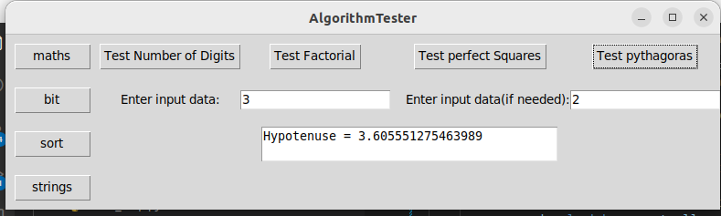

# Manual testing

in this part we created an UI to test some of the functionality of the program as shown in the picture below.
the UI allow the user to choose from 4 diffrent available libraries and from each four diffrent function.
the chosen function has been selected in an attempt to cover various diffrents scenerio.
as such we chose from algorithms that treat decimal numbers,binary numbers,strings and lists.
and we took unto account functions that has one input or two.

## results
the tested functionalities workes as expected with the appropriate results.

