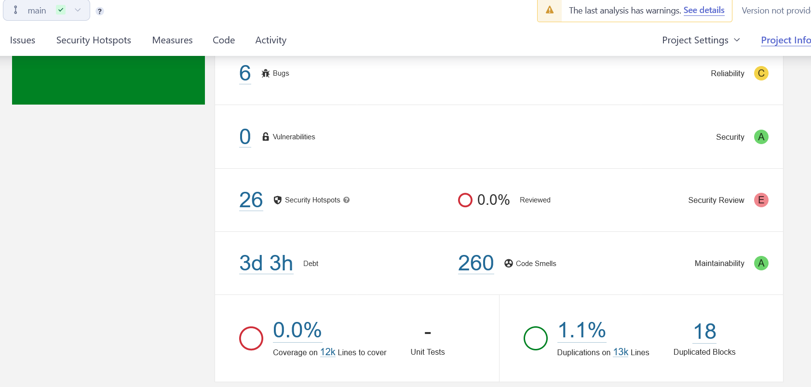

#Introduction:
The static analysis will be performed using SonarQube, this document will walk you through the steps taken to perform the analysis and will contain the review of the problems detected.

#SonarQube:
Is a tool that helps ensure following a standard in our code and help us keep a high quality code, that is more secure and maintainable.
After analysing the source code of a project using SonarQube we receive a feedback including certain problems including Bugs, Vulnerabilities, Security-sensitive code, Code Smells, Coverage and more.

#Installation:
We first start by downloading the SonarQube community version from SonarQube.org
we also need to make sure that we have appropriate Java JDK version installed.
A detailed guide for installing a llocal instance of SonarQube can be found here:
 https://docs.sonarqube.org/latest/try-out-sonarqube/

#First Analysis:
After installing SnarQube, sonar-scanner, and Generating a token, we can finally run a the Analysis:

This is the first feedback we received:

