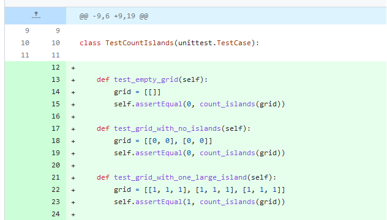
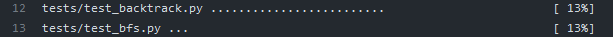

In order to increase the coverage of some unittests, we have tried to add very few more scenarios in the "test_bfs.py" 

This indeed resulted in a slight increase of the coverage. 

However, as mentioned before, even though we can increase the coverage further, there are still more important metrics that can determine the quality of a unittest.
