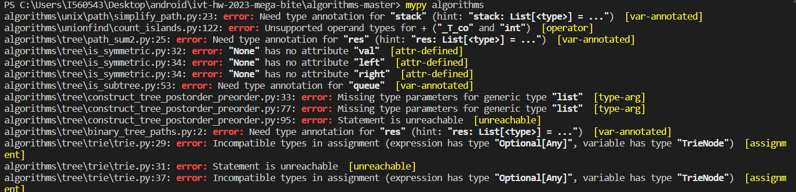

What is mypy?

mypy is a static type checker for Python that verifies and enforces correct usage of types in your code, helping to catch errors and improve code quality.

In order to run it locally, you just write mypy src after installing requirements_dev.txt or you can add it to the workflow:
- name: Run mypy
      run: mypy
