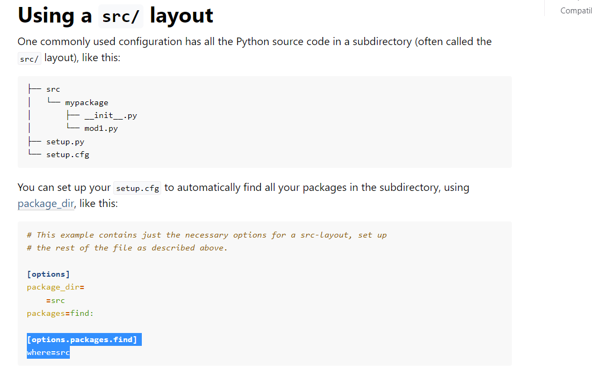

PiP:

In Python, pip is the package installer for the Python programming language. 
It is a command-line tool that allows you to install, upgrade, and manage Python packages from the Python Package Index (PyPI) and other package repositories.

Why I used it ?

After cloning the project I wanted to run the tests but I o this issue " improt Module not found " and this is because that algorithms folder 
is not under tests folder so it was unkonw for it . So I have to make the tests run wherever they are . To acheive this we need to make our project
an installable package.

I created a src directory which contains my algorithms package . 

Then I created pyproject.toml which is a configuration file for my project also I created a setup.cfg where 
I stored all the metadata of my project like the tilte and description . and then I added the information about 
my package and where it is . in the requirements.txt there is my dependencies . 

After that we run pip install -e .  which downloaded all our dependencies. finally we made our project an installable package and then install it into  
the current environment.
let's try to run one of the tests now :

