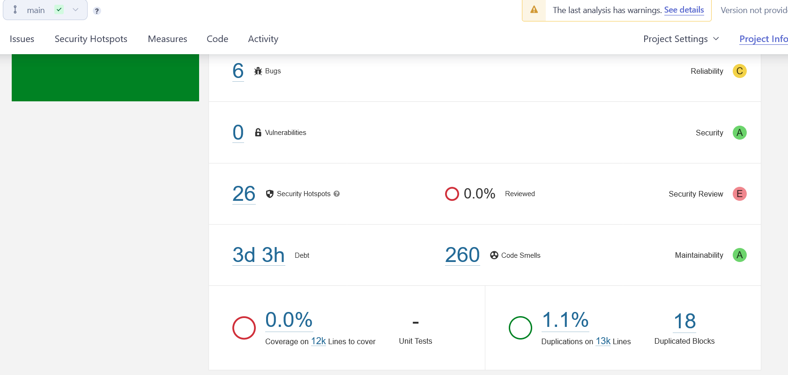
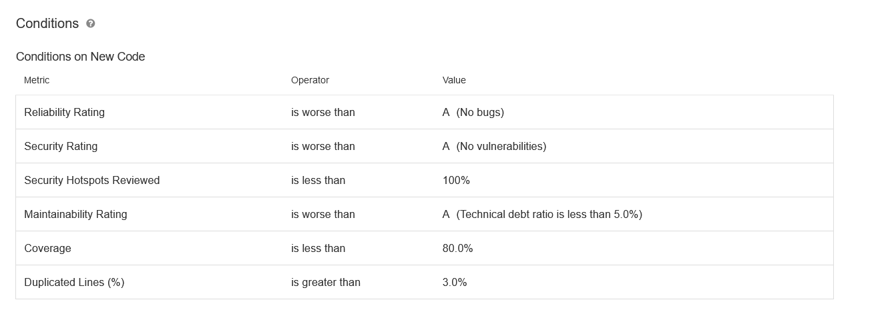
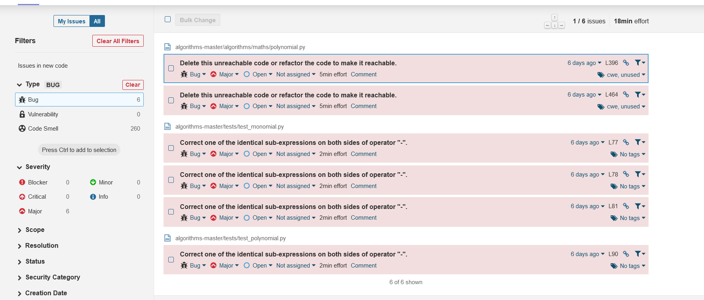
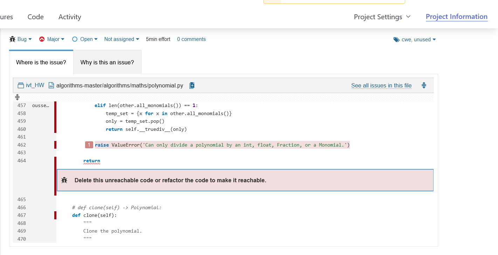
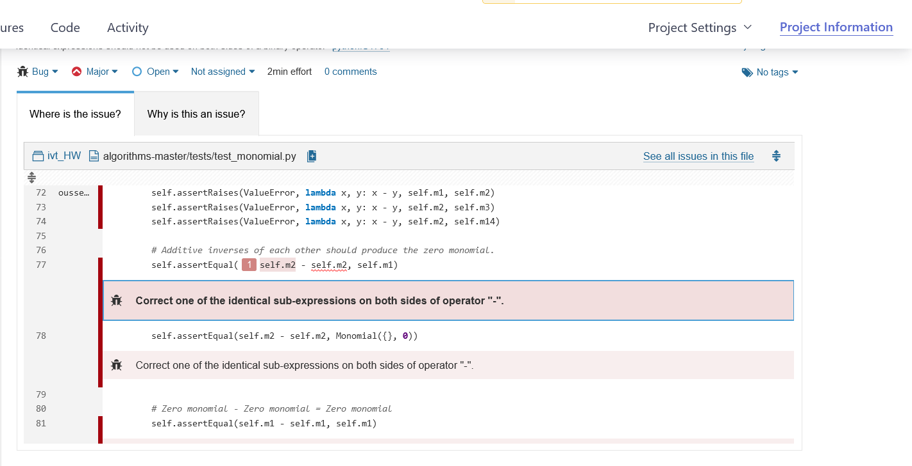
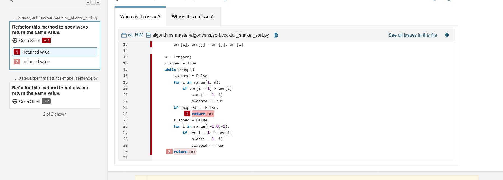

# Introduction:
The static analysis will be performed using SonarQube, this document will walk you through the steps taken to perform the analysis and will contain the review of the problems detected.

# SonarQube:
Is a tool that helps ensure following a standard in our code and help us keep a high quality code, that is more secure and maintainable.
After analysing the source code of a project using SonarQube we receive a feedback including certain problems including Bugs, Vulnerabilities, Security-sensitive code, Code Smells, Coverage and more.

# Installation:
We first start by downloading the SonarQube community version from SonarQube.org
we also need to make sure that we have appropriate Java JDK version installed.
A detailed guide for installing a llocal instance of SonarQube can be found here:
 https://docs.sonarqube.org/latest/try-out-sonarqube/

# Analysis Feedback:
After installing SnarQube, sonar-scanner, and Generating a token, we can finally run a the Analysis:

This is the first feedback we received:

The analysis shows us that the "Quality Gate Status" has passed, The Quality Gate is a set of measure-based Boolean conditions. It helps us know immediately whether our project is ready to be released for production. In simpler words it tests our code against a set of conditions that need to be met. But there still are a lot of problems with the code as we can see in the feedback because passing here is only because the Default quality gate has the passing conditions defined on new code only, rather than on the overall code base.

These are the default conditions of the quality gates, but we still can configure them and choose the conditions more appropriate for our projects depending on our specific needs.

# Code Problems: 

For example we can see here that we have six major bugs.
Two of the bugs caused by having code that is unreachable, the other four bugs are because we have identical sub-expressions on both sides of the operator "-".
 

And we can further review the bugs by clicking on tabs we get.
This will take us to a page that displays where exactely is the bug (the file containing it and the line of code.)

Here we can see that the code has a large number of code smell, 2 of them are Blocker, 53 are critical, 55 are major and 150 minor.

If we further review the two Blocker smells, we can see that they are caused by the returned value, because in the function that contains them the same value will be returned regardless of the code and the conditions that are inside of the function (a lot of unused code).
