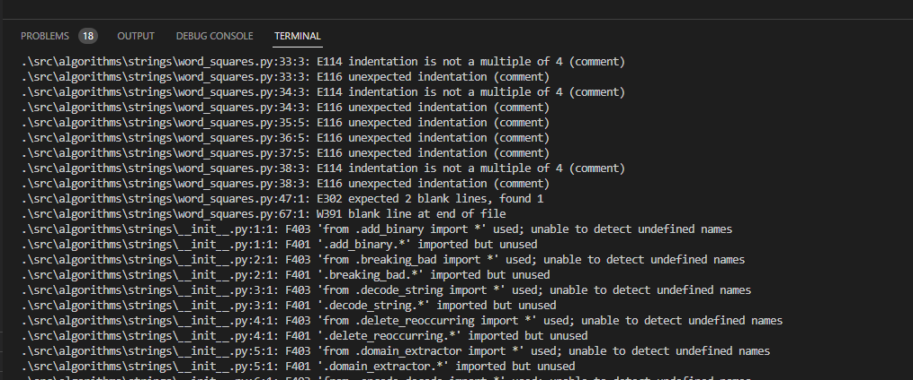

flake8: is a Python code linter and style checker. It combines several individual tools, including pyflakes,
pycodestyle (formerly known as pep8), and mccabe, to examine your code and enforce coding conventions and best practices. 
flake8 checks for issues such as unused variables, missing or incorrect indentation, incorrect naming conventions, and violations of PEP 8 style guidelines.
It helps maintain consistent coding styles and identifies potential bugs or problematic code patterns.

Here is the result after running it: flake8
