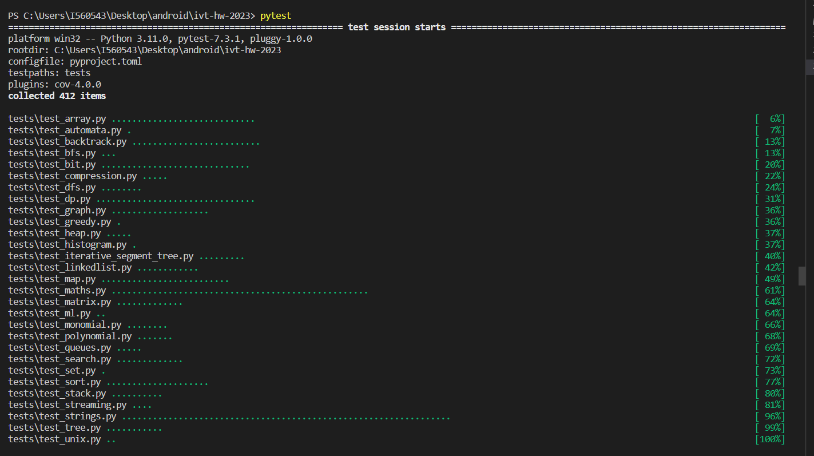
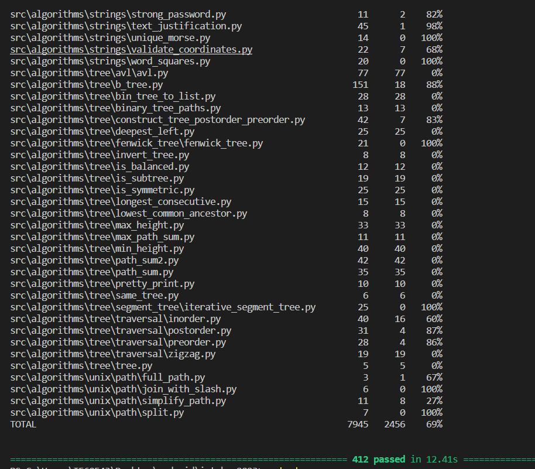

Pytest:
Pytest is a popular testing framework for Python. It provides a simple and efficient way to write tests, 
making the process of testing Python code easier and more effective. 
Pytest is widely used in the Python community and is known for its simplicity, scalability, and powerful features.

How does it work ?
it looks throw my test directory which we specified in configuration and looks for any module that 
starts with test underscore and then within those modules it looks for any function that starts with test underscore
it assumes they ae the tests and run them .

Pytest-cov: Pytest-cov is a pytest plugin that adds code coverage analysis to your test suite. It measures the extent to which your code is being exercised by the tests, highlighting areas that are not covered by tests.

