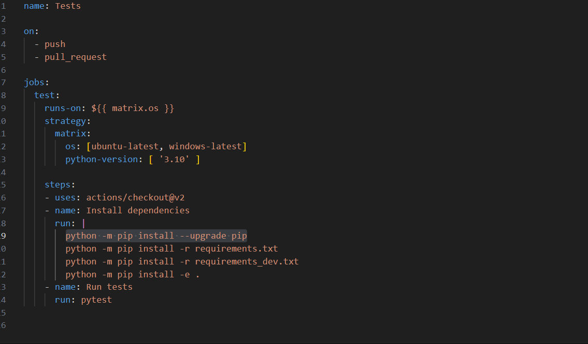
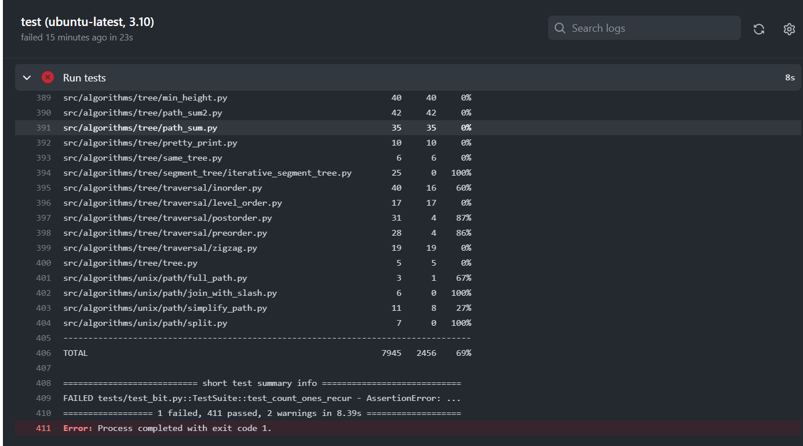
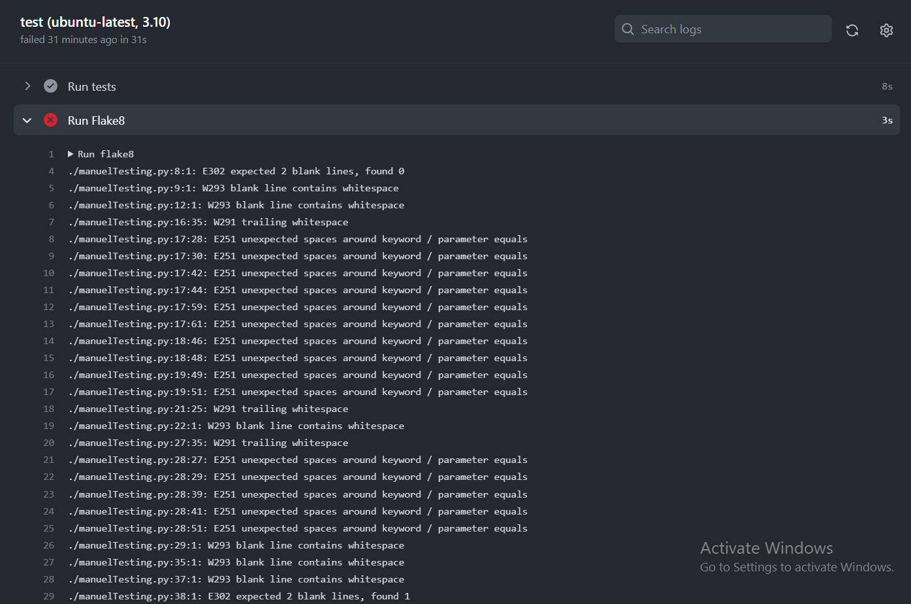
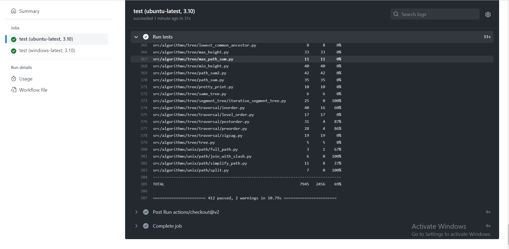

what is workflow:
A workflow is a sequence of automated steps or tasks performed to accomplish a specific goal or process. It defines the order of tasks and can be triggered by events. Workflows streamline processes, automate tasks, and improve efficiency and collaboration.

This workflow configuration sets up a CI process that runs tests on both Ubuntu and Windows operating systems whenever there is a code push or pull request. It ensures that the necessary dependencies are installed before running the tests using the pytest framework.

In the following test: test_bit.py, I made a modification which caused this test to fail when running it using pytest, if a test fails, it means that one of the test cases did not produce the expected result. So we are sure that whenever we write the test, our workflow triggers the test and shows the result.

We wanted to try adding flake8 job to our workflow:
how to add flake8 to our workflow : 
it is easy just we add two lines :
- name: Run flake8
      run: flake8
 
We can see flake8 found many errors related to styling and quality issues so we can proceed and solve them .
We can also add mypy test to the workflow however this project has many issues so we removed flake8 and mypy
and left only pytest and now we will correct the failing test and here is the result:
 